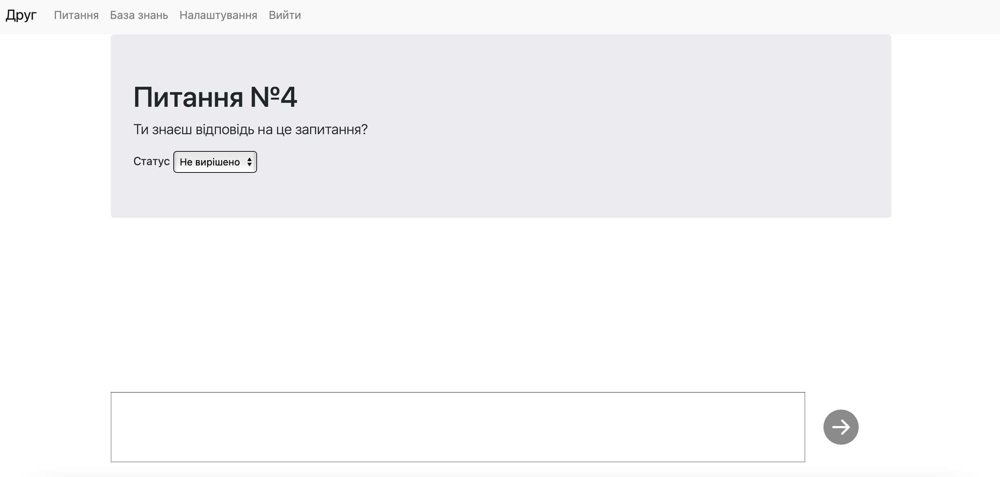

# Про проект
Реалізовано чат-бот платформу для месенджеру Telegram.

# Налаштування
Ключ для управління ботом потрібно задати у файлі server/config.env у поле BOT_TOKEN. Також там можна вказати поле SECRET_KEY - це ключ для генерації JWT токенів.

# Запуск
Додаток запускається за допомогою однієї команди: `docker-compose up`. Ця команда запускає API/Bot сервер, базу данних PostgreSQL, pgbouncer та Frontend для кабінету оператора.
Після запуску, можна перейти на `localhost:3000`, де буде знаходитись кабінет оператора. API додатка працює на `localhost:8080`.

Також у проєкті присутні юніт та інтеграційні тести. Їх можна запустити командою `docker-compose exec server go test -v ./...`.

# Існуючий бот
Ви можете поспілкуватися з вже існуючим ботом по цьому посиланню: https://t.me/friend_ua_bot

# Приклади роботи бота
В боті дуже зручно реалізований вибір країни. Є два способи.
1. Відправити боту геолокацію, і бот сам розпізнає країну.
2. Використовуючи дуже зручний список країн з пагінацією.

Бот автоматично запам'ятає вибір країни й не буде питати її постійно, однак її завжди можна змінити відправивши геолокацію, або скористатись кнопкою `Обрати іншу країну`.

Після вибору країни користувач обирає тему питання, на яке він хоче отримати відповідь.

Коли користувач обрав тему питання, він може її змінити, або поставити питання.

Після того, як користувач поставив запитання, відбувається пошук у Базі Знань. Якщо питання було знайдено, то користувачу повертається відповідь. Наразі реалізовано повнотекстовий пошук.

Ось декілька питань, які можна протестувати:
1. Бразилія, Консульський прийом, Коли відбувається прийом громадян?
2. Бразилія, Паспортні документи, Чи можу я подати документи на паспорт поштою?
3. Австрія, Консульський прийом, Яким чином можна потрапити на прийом до консульського відділу?

Якщо ж питання не було знайдено у Базі знань, то користувачу приходить повідомлення, що його питання було передано оператору.

# Кабінет оператора
З моменту запуску додатку в базі є 3 оператори для 3 країн:
1. TestAustralia
2. TestAustria
3. TestBrazil

У всіх стоять паролі `test`, які можна змінити в особистому кабінеті.

Кожен оператор має доступ до Бази знань та нетипових питань лише у рамках країни, до якої він прив'язаний.
Можна створити свого оператора власноруч. Для цього треба відправити POST запит на `localhost:8080` з JSON `{"username": "TestUser", "password": "test", country_id: 1}`. Значення `country_id` для всіх країн можна подивитись у таблиці `countries`.

У оператора є 3 вкладки
1. Питання
2. База знань
3. Налаштування

На вкладці `Налаштування` оператор може змінити власний пароль.

На вкладці `База знань` оператор може адмініструвати Базу знань. Додавати питання, редагувати та видаляти питання з бази.

На вкладці `Питання` оператор може бачити всі нетипові питання, які стосуються його країни.
Кожне питання має статус — не вирішено, в процесі, вирішено.
Кожне питання супроводжується чатом. Додатково цей чат є real-time. Все, що оператор буде писати в цей чат, користувачу буде дублікувати бот.
А все, що користувач буде писати боту буде в режимі real-time (за допомогою сокетів) показуватись оператору. Після виставлення оператором статусу Вирішено, користувач знову може задати будь яке питання. 

# Методологія
Ми зробили вибір країни двома способами. Перший(через геолокацію) - дуже зручний для користування ботом через смартфон.
Але якщо користувач буде користуватися ботом з комп'ютера (де ще не реалізований вибір геолокації), то він може дуже просто знайти бажану країну за допомогою списку з пагінацією.

У кабінеті оператора є real-time чат. Це дуже зручно й ефективно, бо оператор буде відразу бачити нове повідомлення від користувача.
Тому було вирішено зробити чат саме за допомогою сокетів, щоб добитися бажаного ефекту.

# Наступні кроки
1. Подальший аналіз та генерування списку поширених запитань, які можна пропонувати користувачам за обраною темою.
2. Інтеграція алгоритмів розуміння природної мови з платформою.
3. Сповіщення про появу нового запитання у кабінеті оператора.
4. Можливість електронного запису на консульський прийом без попереднього спілкування з оператором.
5. Організація котролю якості роботи платформи за рахунок отримання фідбеку від користувачів.

# Виконані критерії оцінювання
1. Реалізація пошуку відповідей на запитання користувача
2. Зручність та надійність визначення та врахування країни перебування користувача. Можливість користувачу перевизначити її.
3. Кабінет оператора, можливість адмініструвати базу знань.
4. Підтримка нетипових запитань та відповідей.
5. Навігація по розділах бази знань.
6. Права доступу операторів в залежності від їх належності до країни.
7. Наявність юніт та інтеграційних тестів.

